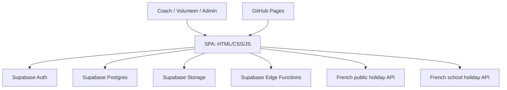

# Technical Architecture

This document describes the technical architecture of the Judo Coach Tracker for the Judo Club de Cattenom-Rodemack.

---

## System Overview

- Static SPA (HTML, CSS, ES6 JS modules), no build step
- Supabase (Postgres, Auth, Storage, Edge Functions) for backend
- Hosted on GitHub Pages
- PWA: service worker for offline/installable support
- Row-Level Security (RLS) in Supabase; admin actions via Edge Functions

---

## Architecture Diagram

---

## Key Principles

- All UI, state, and orchestration in the browser
- Supabase as BaaS: persistence, authentication, RLS, file storage
- Serverless Edge Functions for privileged/admin actions
- Static deployment: no build step, files on GitHub Pages
- Security: RLS enforced in Supabase

---

## Repository Structure

- `public/` — Static frontend (HTML, JS, CSS, PWA, modules)
- `supabase/` — Config, SQL migrations, Edge Functions
- `docs/` — Documentation
- `.github/workflows/` — CI/CD for deploys
- `scripts/` — Admin/dev helper scripts

---

## Key Modules

- `app-modular.js`: Main SPA logic, imports all modules, handles Supabase client, state, orchestration
- `modules/pwa.js`: Registers service worker, manages PWA install prompt
- `modules/rest-gateway.js`: Handles REST API calls for user/admin management
- `modules/audit-controller.js`: Renders/filters audit logs for admins
- `modules/auth-admin.js` / `auth-runtime.js`: Admin checks, authentication, session management
- `modules/env.js`: Environment and Supabase project selection (dev/prod, overrides)

---

## Supabase Integration

- Auth: Supabase Auth for login, registration, session
- Database: Postgres with RLS for all user/admin data
- Storage: File uploads (receipts, justifications) in Supabase Storage
- Edge Functions: TypeScript functions for privileged/admin actions (invite, delete, audit, etc)

---

## Security

- RLS: All data access protected by Row-Level Security in Supabase
- Admin actions: Only via Edge Functions with service role key
- Audit logging: All sensitive actions logged and viewable by admins

---

## External Integrations

- French public/school holiday APIs: For calendar color coding/validation

---

## Development & Deployment

- No build step: edit JS/HTML/CSS and reload in browser
- Supabase CLI: use npm scripts for migrations, config, function deploys
- CI/CD: GitHub Actions for Pages and Supabase Edge Functions deploys
- **State:** In-memory JS objects for user, month, time data, and caches.

### 5.2 UI Composition
- Auth panel, toolbar, profile/month selectors, calendar grid, summary, modals (profile, day entry, help, onboarding).

### 5.3 PWA Details
- Service worker caches all static assets and provides offline fallback.
- Manifest for installability and icons.

---

## 6. Backend Architecture

### 6.1 Supabase Services
- **Auth:** Email/password authentication, session management.
- **Database:** PostgreSQL with RLS for all tables (users, time_data, frozen_timesheets, etc).
- **Storage:** File uploads (receipts, justifications) in a dedicated bucket.
- **Edge Functions:**
  - `invite-coach`, `invite-admin`: Secure coach/admin onboarding
  - `delete-coach-user`: Admin-only user deletion
  - `app`: General privileged operations

### 6.2 Security
- **Row-Level Security:** All data access is protected by RLS policies.
- **Service Role Key:** Edge Functions use service role for admin actions.

---

## 7. Data Model (Simplified)

### 7.1 Main Tables
- `users`: Coach/admin profiles, roles, invite status
- `time_data`: Per-day work, competition, mileage, expenses
- `frozen_timesheets`: Month freeze status

### 7.2 Storage
- `justifications` bucket: PDF/JPG/PNG receipts

---

## 8. CI/CD and Deployment

- **Frontend:** GitHub Actions auto-deploys to GitHub Pages on push to `main`.
- **Edge Functions:** GitHub Actions deploys Supabase Edge Functions on push.
- **Migrations:** SQL migrations in `supabase/migrations/` applied via Supabase CLI.

---

## 9. External Integrations

- **French public holiday API**: For calendar highlights
- **French school holiday API**: For school holiday coloring

---

## 10. Developer Notes

- No framework or bundler: All code is plain JS modules.
- All business logic is in `public/app-modular.js`.
- Use Supabase CLI for local dev, migrations, and function deploys.
- RLS policies are critical—review them before schema changes.
- Edge Functions are TypeScript, deployed via Supabase CLI.

---

## 11. Further Reading

- [Supabase Docs](https://supabase.com/docs)
- [GitHub Pages Docs](https://pages.github.com/)
- [PWA Overview](https://web.dev/progressive-web-apps/)

- **Auth** for email/password accounts and invitations
- **Postgres** for domain data
- **Storage** for uploaded receipts
- **Edge Functions** for privileged admin operations
- **PostgREST / RPC** for database access from the browser

## 5.2 Database model

### `public.users`

Profile table for both coaches and volunteers.

Main responsibilities:

- stores personal and payroll-related profile data
- links a business profile to a Supabase auth account via `owner_uid`
- distinguishes profile type (`coach` vs `benevole`)
- keeps legacy display role aligned (`entraineur` vs `benevole`)

Representative fields:

- `id`
- `name`
- `first_name`
- `email`
- `address`
- `vehicle`
- `fiscal_power`
- `hourly_rate`
- `daily_allowance`
- `km_rate`
- `profile_type`
- `role`
- `owner_uid`

### `public.time_data`

Stores day-level activity and expense entries.

Responsibilities:

- training-hour capture
- competition-day capture
- travel and mileage details
- toll, hotel, and purchase expenses
- receipt URL persistence
- ownership and audit linkage back to a profile/user

Representative fields:

- `id`
- `coach_id`
- `date`
- `hours`
- `competition`
- `km`
- `description`
- `departure_place`
- `arrival_place`
- `peage`
- `hotel`
- `achat`
- `justification_url`
- `hotel_justification_url`
- `achat_justification_url`
- `owner_uid`
- `owner_email`

Important constraint:

- unique day row per profile/date pair

### `public.frozen_timesheets`

Controls edit locking at monthly granularity.

Responsibilities:

- records a frozen month per profile
- blocks write operations for non-admin users on locked months
- allows UI to show a frozen banner and disable edits

Representative fields:

- `id`
- `coach_id`
- `month`
- `frozen_at`
- `frozen_by`

### Storage bucket: `justifications`

Used for receipt upload and retrieval.

Typical object naming strategy:

- `{user_id}/{date}_{prefix}_{filename}`

Supported files include:

- PDF
- JPG
- PNG

## 5.3 Security model

Security is shared between:

- **client-side UX checks** for user feedback
- **server-side RLS** for actual enforcement
- **Edge Functions** for actions that require service-role privileges

### Authentication

Users authenticate with Supabase Auth.

Important patterns in the app:

- persistent browser session
- password reset support
- invite-link onboarding
- local JWT inspection for fast admin detection
- fallback RPC check through `public.is_admin()`

### Authorization

The main authorization concepts are:

- normal users can access only their own profile and entries
- admins can access all profiles and entries
- frozen months block writes for non-admin users
- invitation and deletion flows run through Edge Functions, not directly in the client

### RLS and helper functions

Key helper functions and policy concepts include:

- `public.is_admin()` reads `app_metadata.is_admin` from the JWT
- `public.claim_user_profile()` atomically links an invited profile to the first authenticated account with the matching email
- `public.claim_coach_profile()` remains as a compatibility wrapper
- explicit `time_data` RLS policies enforce ownership/admin/frozen-month rules

---

## 6. Edge Functions

## 6.1 `invite-coach`

Purpose:

- lets an admin send an invitation email to a coach profile

Behavior:

- validates caller identity from bearer token
- checks admin access
- calls Supabase Admin API `inviteUserByEmail`
- uses configured `redirectTo` URL or site URL fallback

Why it exists:

- invitation requires privileged auth admin operations
- service role key must never be exposed to the browser

## 6.2 `invite-admin`

Purpose:

- invites a new administrator or upgrades an existing user to admin

Behavior:

- validates caller admin access
- invites by email when needed
- updates `app_metadata.is_admin = true`

## 6.3 `delete-coach-user`

Purpose:

- deletes the linked Supabase Auth user of a coach profile

Behavior:

- validates caller admin access
- resolves user by explicit `userId` or email lookup
- deletes the auth account through the admin API

## 6.4 `app`

Purpose:

- optional static SPA host served from Supabase Edge Functions

Behavior:

- serves `index.html` for routes
- serves static assets with correct MIME types
- injects a `<base>` tag for nested routing compatibility

This is an alternative hosting path, not the only deployment mode.

---

## 7. Key Business Flows

## 7.1 Standard login flow

1. user opens SPA
2. Supabase client restores session if present
3. app determines whether the user is admin
4. app loads profiles, day data, and frozen months
5. UI renders calendar and monthly totals

## 7.2 Invite and claim flow

1. admin creates a profile in `public.users`, optionally with `owner_uid = NULL`
2. admin triggers `invite-coach`
3. invited user receives Supabase invitation email
4. user follows link and sets password
5. frontend calls `claim_user_profile()` / compatibility wrapper
6. matching unclaimed profile is linked to `auth.uid()`
7. future reads and writes work through normal RLS

## 7.3 Day save flow

1. user opens a day modal
2. frontend computes entry payload
3. if needed, receipt files are uploaded first to Storage
4. frontend checks whether a day row already exists
5. app performs insert, update, or delete on `public.time_data`
6. RLS validates ownership/admin access and frozen-month rules
7. local in-memory cache is updated and summary/calendar rerendered

## 7.4 Freeze flow

1. admin selects profile and month
2. admin toggles freeze state
3. frontend writes to `public.frozen_timesheets`
4. non-admin writes for that month are blocked both in UI and DB policies

## 7.5 Export flow

The frontend generates exports client-side.

### Salary declaration export

- generated as real `.xlsx`
- built in-browser using ExcelJS loaded dynamically
- includes club branding and formatting
- suitable for Excel or PDF printing

### Expense note export

- generated as printable HTML
- intended for browser print / PDF
- includes mileage, toll, hotel, and purchase expenses

### JSON backup

- exports month data for backup/import use cases

---

## 8. External Integrations

## 8.1 Public holidays API

Used to color French public holidays in the calendar.

Characteristics:

- fetched dynamically at runtime
- cached in memory per year
- static fallback data available if network request fails

## 8.2 School holidays API

Used to highlight school holiday periods in the calendar.

Characteristics:

- fetched dynamically from French open data
- filtered by `zones = "Zone B"`
- deduplicated in the frontend because API results are location-based
- static fallback data available for resilience

---

## 9. Deployment Architecture

## 9.1 Frontend hosting

The frontend is static and can be hosted on:

- GitHub Pages
- Firebase Hosting
- custom static hosting
- optional Supabase Edge Function host (`functions/app`)

### Current repository support

- `.github/workflows/deploy-pages.yml` deploys `public/` to GitHub Pages on push to `main`
- `firebase.json` provides SPA rewrites for Firebase Hosting

## 9.2 Backend deployment

Supabase backend assets are deployed separately:

- database migrations via Supabase CLI
- auth/site URL settings via `supabase config push`
- Edge Functions via `.github/workflows/deploy-supabase.yml`

## 9.3 Environment and configuration

Central Supabase configuration lives in:

- `public/app-modular.js` for project URL and anon key
- `supabase/config.toml` for project ref, auth site URL, redirect URLs, and function settings

Important operational settings:

- `project_id = "ajbpzueanpeukozjhkiv"`
- canonical site URL is `https://jccattenom.cantarero.fr/`
- GitHub Pages URLs are included as allowed redirect URLs

---

## 10. Observability and Debugging

The frontend includes built-in diagnostic logging, especially around:

- fetch calls to Supabase
- auth/session initialization
- admin detection
- invitation flow diagnostics
- service worker registration

This is useful because the system depends heavily on:

- browser session state
- JWT claims
- RLS behavior
- external APIs

The recent architecture evolution also introduced explicit compatibility and cleanup migrations to remove legacy references such as `timesheet_freezes` after schema changes.

---

## 11. Architectural Strengths

- very low infrastructure footprint
- no frontend build pipeline required
- strong security boundary through Supabase RLS
- privileged actions isolated in Edge Functions
- easy static deployment
- practical offline/PWA support
- export generation kept in-browser to reduce backend complexity

---

## 12. Architectural Constraints and Risks

## 12.1 Large frontend module

`public/app-modular.js` centralizes many concerns:

- auth
- data access
- state management
- rendering
- exports
- admin workflows
- diagnostics

This makes iteration fast, but increases maintenance cost and regression risk.

## 12.2 Embedded public configuration

The frontend contains the public Supabase URL and anon key. This is acceptable for Supabase public clients, but all sensitive operations must remain protected by:

- RLS
- Edge Functions with service role keys on the server side only

## 12.3 Schema evolution sensitivity

Because authorization depends on RLS and SQL helper functions, schema renames must be accompanied by:

- migration updates
- compatibility rollouts when needed
- remote database cleanup of legacy objects

## 12.4 Client-side exports

Client-side document generation reduces backend load, but it means:

- export logic is coupled to frontend code
- PDF fidelity depends on browser print behavior
- large exports may stress lower-end devices

---

## 13. Recommended Future Improvements

### Short term

- split `app-modular.js` into focused modules:
  - auth
  - data access
  - calendar
  - exports
  - admin
  - utilities
- add a dedicated architecture decision log
- align README export descriptions with the current XLSX/expense implementation
- reduce production debug logging once stability is confirmed

### Medium term

- introduce automated integration tests for critical flows:
  - invite and claim
  - save/update/delete day entry
  - frozen-month enforcement
  - export smoke tests
- add migration smoke checks for renamed relations and policy dependencies
- document RLS policies more formally in a dedicated security document

### Long term

- move from monolithic script to a typed modular frontend structure
- centralize configuration through environment substitution at deploy time
- add structured audit history for admin actions and month freezing

---

## 14. Summary

The application is a static browser-based operations tool backed by Supabase.

Its architecture is optimized for simplicity:

- **frontend**: static SPA with vanilla JavaScript
- **backend**: Supabase Auth, Postgres, Storage, Edge Functions
- **security**: JWT claims + RLS + service-role serverless functions
- **deployment**: static hosting plus serverless backend deployment

This design is well suited to a small administrative application with moderate complexity, fast iteration needs, and limited infrastructure overhead.
