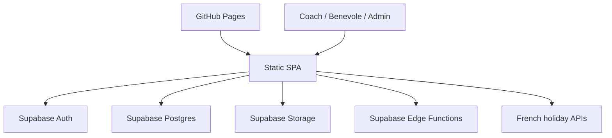

# Technical Architecture — JC Cattenom App

This document summarizes the current architecture of the jccattenom-app repository.

## System Overview

- frontend is a static single-page application in `public/`
- browser code uses plain JavaScript ES modules with no build step
- `public/app-modular.js` orchestrates ~20 ES modules under `public/modules/`
- backend services are provided by Supabase Auth, Postgres, Storage, and Edge Functions
- the app is deployed as a PWA and hosted through GitHub Pages with a custom domain
- environment routing between dev and prod is handled in the browser by `public/modules/env.js`
- HelloAsso integration for club member synchronization

## Runtime Topology



## Frontend Architecture

Primary frontend entry points:
- `public/index.html`  shell markup and modal containers
- `public/app-modular.js`  main application orchestration and UI wiring
- `public/style.css`  global styling
- `public/sw.js`  service worker
- `public/manifest.webmanifest`  PWA manifest

Important browser modules:
- `public/modules/env.js`  dev/prod backend selection and persisted override logic
- `public/modules/supabase-client.js`  singleton Supabase client with debug wrappers
- `public/modules/app-context.js`  shared mutable state and cross-module helpers
- `public/modules/auth-runtime.js`  auth session and invite-flow helpers
- `public/modules/auth-admin.js`  admin detection helpers (local claims + REST)
- `public/modules/auth-listeners.js`  Supabase auth event subscriptions
- `public/modules/admin-service.js`  admin role checks and alert notifications
- `public/modules/profile-utils.js`  user/profile display and typing helpers
- `public/modules/data-loader.js`  loads coaches, time_data, frozen_timesheets; populates dropdowns
- `public/modules/calendar-ui.js`  calendar rendering, day modal, saveDay/deleteDay, file upload
- `public/modules/coach-manager.js`  profile CRUD, invite flows, modal UI helpers
- `public/modules/summary-ui.js`  monthly summary display, freeze management
- `public/modules/export-ui.js`  export UI factory (timesheet + expense report)
- `public/modules/export-runtime.js`  ExcelJS loader and export orchestration
- `public/modules/display-format.js`  number and currency formatting helpers
- `public/modules/shared-utils.js`  base64, email/month normalization, claim helpers
- `public/modules/mileage-service.js`  mileage calculation logic
- `public/modules/rest-gateway.js`  REST and privileged-operation helpers
- `public/modules/holidays-service.js`  French public/school holiday fetching logic
- `public/modules/holidays-data.js`  holiday data caching and helpers
- `public/modules/helloasso-service.js`  HelloAsso member sync service
- `public/modules/helloasso-ui.js`  HelloAsso UI components
- `public/modules/audit-controller.js` and `public/modules/audit-ui.js`  audit-log rendering and formatting
- `public/modules/pwa.js`  install prompt and PWA behavior
- `public/modules/event-listeners.js`  global event wiring
- `public/modules/debug-shims.js`  development debug helpers
- `public/modules/invite-debug.js`  invite flow debug utilities

Frontend characteristics:
- all UI state is managed in the browser
- month, profile, summary, and modal state are kept client-side
- exports are generated as HTML documents in the browser
- the application supports standalone/PWA mode and a browser-tab mode

## Environment Model

Environment routing is centralized in `public/modules/env.js`.

Current precedence:
1. `?env=dev` or `?env=prod`
2. persisted localStorage override `jct.env.override`
3. hostname detection

Current hostname rules:
- `localhost` and `127.0.0.1` map to `dev`
- `dev`, `dev.*`, and `dev-*` hosts map to `dev`
- all other hosts map to `prod`

Additional notes:
- `?env=auto` clears the persisted override
- local dev credentials can be overridden with `jct.dev.supabase.url` and `jct.dev.supabase.key`
- the production frontend host is `jccattenom.cantarero.fr`

## Backend Architecture

Supabase responsibilities:
- Auth for login, session persistence, invite onboarding, and password reset flows
- Postgres for business data
- Storage for uploaded receipts and supporting files
- Edge Functions for privileged admin operations

Current Edge Functions under `supabase/functions/`:
- `alert-admin`  admin alert notifications
- `app`  general-purpose app-level function
- `delete-coach-user`  privileged user deletion
- `export-monthly-expenses`  server-side monthly expense export
- `invite-admin`  admin invitation flow
- `invite-coach`  coach/volunteer invitation flow
- `sync-helloasso`  HelloAsso member synchronization

Backend configuration files:
- `supabase/config.toml`
- `supabase/config.dev.toml`
- `supabase/config.prod.toml`

Deployment scripts and wrappers:
- npm scripts in `package.json` provide environment-specific wrappers for database push, config push, and function deploy
- `scripts/supabase-config-push.mjs` applies environment-specific auth/site URL config safely
- `scripts/supabase-functions-deploy.mjs` deploys functions to the selected Supabase project

## Data Model Summary

Core tables represented by the current migrations and app logic:

### `users`

Purpose:
- stores coach and volunteer profile information
- links profiles to Supabase Auth users through `owner_uid`
- carries role/type-related information used by the UI and access model

Representative fields:
- `id`
- `name`
- `first_name`
- `email`
- `address`
- `vehicle`
- `fiscal_power`
- `hourly_rate`
- `daily_allowance`
- `km_rate`
- `profile_type`
- `role`
- `owner_uid`

### `time_data`

Purpose:
- stores per-day activity and expense data
- supports training hours, competition days, mileage, tolls, hotel expenses, and purchases
- stores receipt URLs and ownership metadata

Representative fields:
- `id`
- `coach_id`
- `date`
- `hours`
- `competition`
- `km`
- `description`
- `departure_place`
- `arrival_place`
- `peage`
- `hotel`
- `achat`
- `justification_url`
- `hotel_justification_url`
- `achat_justification_url`
- `owner_uid`
- `owner_email`

Constraint shape:
- one row per profile and date

### `frozen_timesheets`

Purpose:
- stores month-level freeze state
- blocks modification of locked periods for non-admin users
- supports UI freeze indicators and admin workflows

Representative fields:
- `id`
- `coach_id`
- `month`
- `frozen_at`
- `frozen_by`

### `audit_logs`

Purpose:
- records sensitive administrative and export actions
- supports admin review of operational history

### Storage bucket `justifications`

Purpose:
- stores uploaded receipt files for reimbursement-related entries

## Security Model

Security is split across multiple layers:
- browser-side UX checks for immediate feedback
- Supabase Row-Level Security for actual data enforcement
- Edge Functions for privileged admin actions
- audit logging for sensitive operations

Important security characteristics:
- normal users access only their own data unless elevated through admin checks
- admin operations are validated server-side
- frozen months prevent unauthorized modifications
- receipt and export flows still need the browser layer to sanitize generated HTML content before rendering previews or downloaded artifacts

## HelloAsso Integration

The app integrates with HelloAsso for club member synchronization:
- `public/modules/helloasso-service.js` triggers server-side sync and reads synced member data from the browser
- `public/modules/helloasso-ui.js` provides the UI for the sync workflow
- `supabase/functions/sync-helloasso` is the server-side Edge Function that performs the actual sync against the HelloAsso API

## External Integrations

The frontend consumes French holiday data for calendar display and validation logic:
- public holiday data
- school holiday data

## Deployment and Operations

Frontend:
- GitHub Pages deployment is handled by `.github/workflows/deploy-pages.yml`
- `public/CNAME` sets the custom domain

Backend:
- `.github/workflows/deploy-supabase.yml` handles Edge Function deployment
- schema changes are applied through `supabase/migrations/` using the npm wrappers

Recommended environment-specific commands:

```bash
npm run sb:db:push:dev
npm run sb:db:push:prod
npm run sb:config:push:dev
npm run sb:config:push:prod
npm run sb:functions:deploy:dev
npm run sb:functions:deploy:prod
```

Combined update commands:

```bash
npm run env:dev
npm run env:prod
```

## Developer Notes

- prefer repository patterns over introducing frameworks or a build system
- `public/app-modular.js` remains the main orchestration file even though behavior is increasingly split into `public/modules/`
- environment-sensitive backend work should use the existing npm wrappers rather than ad hoc commands
- migrations, RLS, and auth-related changes should be reviewed together because the app depends on their combined behavior
